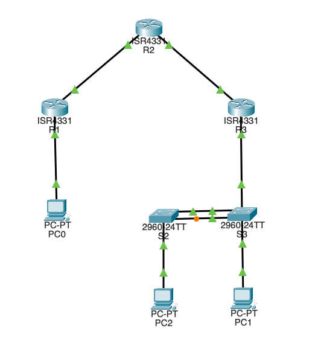

# Network Security Lab (Packet Tracer): IPsec S2S + OSPF (HMAC) + VLAN Segmentation

Author: Antoni Gąsiorowski

## Overview
This repository contains a Cisco Packet Tracer lab demonstrating practical network security controls in a small routed environment:

- Site-to-Site IPsec VPN protecting traffic between Site A (192.168.1.0/24) and Site B VLAN 3 (172.16.3.0/24) using AES-256, ESP-AES-256/ESP-SHA-HMAC, and PFS group5
- OSPF Area 0 for dynamic routing across WAN links
- OSPF adjacency authentication (key-chain with HMAC-SHA-256) on the transit adjacency (R2–R3)
- VLAN segmentation at Site B using router-on-a-stick on R3:
  - VLAN 3: 172.16.3.0/24 (INSIDE)
  - VLAN 33: 172.16.33.0/24 (GUEST)
- Access-layer hardening (where configured): PortFast + BPDU Guard, port-security (sticky MAC), trunk hardening (native VLAN 99, DTP disabled)

## Topology

High-level structure:
- R1 (Site A) ↔ R2 (Transit) ↔ R3 (Site B)
- Site A LAN behind R1: 192.168.1.0/24
- Site B VLANs behind R3: 172.16.3.0/24 (VLAN 3) and 172.16.33.0/24 (VLAN 33)

## Key Security Controls

### IPsec Site-to-Site VPN
- IKE policy: AES-256, pre-shared key, DH group 5
- IPsec transform-set: ESP-AES-256 + ESP-SHA-HMAC
- PFS: group5
- Interesting traffic is scoped with extended ACLs:
  - 192.168.1.0/24 ↔ 172.16.3.0/24

### OSPF Security (Control Plane)
- OSPF is enabled across WAN links (Area 0)
- Key-chain authentication (HMAC-SHA-256) is applied on the R2–R3 adjacency to reduce the risk of routing protocol spoofing/poisoning

### Segmentation (Data Plane)
- Two L2 segments at Site B (VLAN 3 and VLAN 33) terminate on R3 802.1Q subinterfaces
- Switch management/hosts are placed in VLAN 3 (172.16.3.0/24) and VLAN 33 (172.16.33.0/24), depending on the scenario

## Quick verification (minimal)

### OSPF (R1 / R3)
- show ip ospf neighbor
- show ip route ospf

Reference outputs (captured):

R1:
show ip ospf neighbor
Neighbor ID     Pri   State           Dead Time   Address         Interface
64.100.3.2        1   FULL/BDR        00:00:33    64.100.1.2      GigabitEthernet0/0/0

show ip route ospf
O       172.16.3.0   [110/3] via 64.100.1.2, GigabitEthernet0/0/0
O       172.16.33.0  [110/3] via 64.100.1.2, GigabitEthernet0/0/0

ping 172.16.3.1
!!!!! (100% success)

R3:
show ip ospf neighbor
Neighbor ID     Pri   State           Dead Time   Address         Interface
64.100.3.2        1   FULL/BDR        00:00:33    64.100.3.2      GigabitEthernet0/0/0

show ip route ospf
O    192.168.1.0 [110/3] via 64.100.3.2, GigabitEthernet0/0/0

### VLAN segmentation (Site B: switches + R3 ROAS)
S2:
show vlan brief
- VLAN 3 (INSIDE) active, host on Fa0/18
- VLAN 99 used as parking VLAN for unused ports

S3:
show vlan brief
- VLAN 33 (GUEST) active, host on Fa0/18
- VLAN 99 used as parking VLAN for unused ports

R3:
show ip interface brief
- Gi0/0/1.3  = 172.16.3.1   up/up
- Gi0/0/1.33 = 172.16.33.1  up/up

Optional cleanup:
- Gi0/0/0.3 exists but is administratively down (unused); it can be removed if desired.

### IPsec (R1 / R3)
1) Generate interesting traffic:
- from Site A (192.168.1.0/24): ping 172.16.3.1 (VLAN 3 gateway) or a VLAN 3 host

2) Verify:
- show crypto isakmp sa
- show crypto ipsec sa

Expected:
- IKE SA established (e.g., QM_IDLE)
- IPsec SA counters (encaps/decaps) increase after traffic

Known PT limitations affecting this lab:
- Zone-Based Firewall (ZBF/ZPF) support is limited; Packet Tracer does not reliably allow assigning zones to 802.1Q subinterfaces (router-on-a-stick), so ZPF policies on R3 subinterfaces cannot be demonstrated consistently.

---

# Laboratorium Network Security (Packet Tracer): IPsec S2S + OSPF (HMAC) + Segmentacja VLAN

Autor: Antoni Gąsiorowski

## Opis
Repozytorium zawiera laboratorium Cisco Packet Tracer pokazujące praktyczne mechanizmy bezpieczeństwa w małej sieci routowanej:

- Tunel Site-to-Site IPsec chroniący ruch między Site A (192.168.1.0/24) a Site B VLAN 3 (172.16.3.0/24) z użyciem AES-256, ESP-AES-256/ESP-SHA-HMAC oraz PFS group5
- OSPF Area 0 do routingu dynamicznego na łączach WAN
- Uwierzytelnianie sąsiedztwa OSPF (key-chain z HMAC-SHA-256) na sąsiedztwie tranzytowym (R2–R3)
- Segmentacja VLAN w Site B z router-on-a-stick na R3:
  - VLAN 3: 172.16.3.0/24 (INSIDE)
  - VLAN 33: 172.16.33.0/24 (GUEST)
- Utwardzenie warstwy dostępowej (tam gdzie skonfigurowane): PortFast + BPDU Guard, port-security (sticky MAC), hardening trunków (native VLAN 99, wyłączone DTP)

## Topologia

Struktura (wysoki poziom):
- R1 (Site A) ↔ R2 (Tranzyt) ↔ R3 (Site B)
- LAN w Site A za R1: 192.168.1.0/24
- VLANy w Site B za R3: 172.16.3.0/24 (VLAN 3) oraz 172.16.33.0/24 (VLAN 33)

## Kluczowe mechanizmy bezpieczeństwa

### IPsec Site-to-Site
- Polityka IKE: AES-256, pre-shared key, DH group 5
- Transform-set IPsec: ESP-AES-256 + ESP-SHA-HMAC
- PFS: group5
- Zakres szyfrowanego ruchu (interesting traffic) ograniczony ACL:
  - 192.168.1.0/24 ↔ 172.16.3.0/24

### Bezpieczeństwo OSPF (control plane)
- OSPF działa na łączach WAN (Area 0)
- Key-chain authentication (HMAC-SHA-256) na sąsiedztwie R2–R3 ogranicza ryzyko spoofingu/poisoningu protokołu routingu

### Segmentacja (data plane)
- Dwa segmenty L2 w Site B (VLAN 3 i VLAN 33) terminują na subinterfejsach 802.1Q na R3

## Szybka weryfikacja (minimum)

OSPF (R1 / R3)
- show ip ospf neighbor
- show ip route ospf
- ping 172.16.3.1 (z Site A)

VLAN / ROAS (Site B)
- S2/S3: show vlan brief
- R3: show ip interface brief (Gi0/0/1.3 i Gi0/0/1.33 up/up)

IPsec (R1 / R3)
- show crypto isakmp sa
- show crypto ipsec sa

Znane ograniczenia PT w tym labie:
- Zone-Based Firewall (ZBF/ZPF) jest ograniczony; Packet Tracer nie pozwala niezawodnie przypisać zone do subinterfejsów 802.1Q (router-on-a-stick), więc nie da się konsekwentnie zademonstrować polityk ZPF na subinterfejsach R3.
